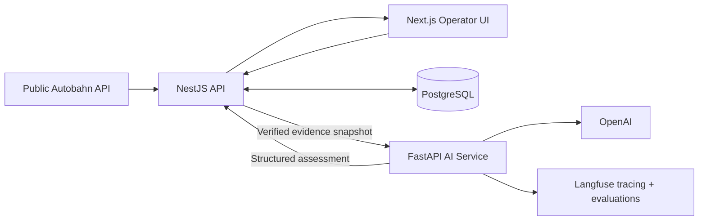
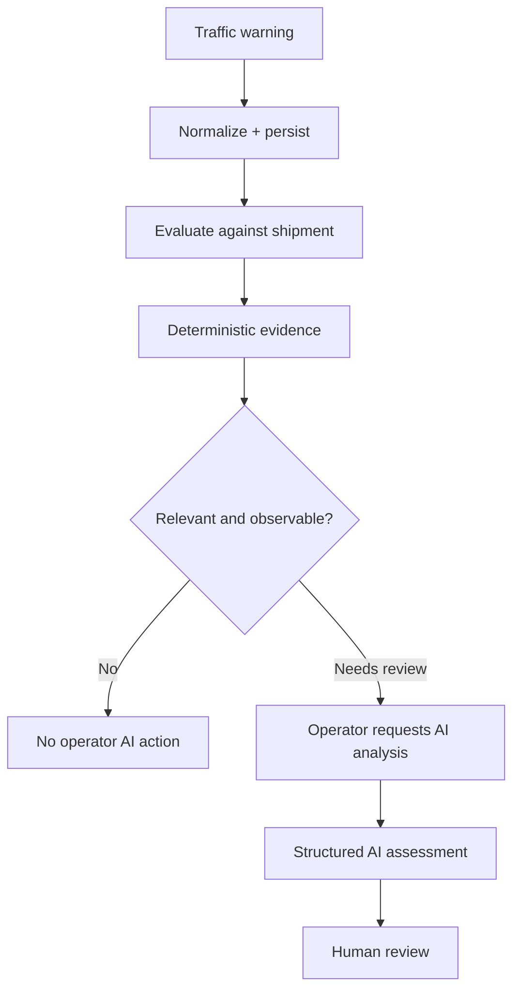

# LieferRadar

LieferRadar is a demonstration supply-chain disruption copilot. It combines public Autobahn traffic data, deterministic route evidence, and constrained AI reasoning to help logistics operators identify shipments that may require attention.

It is a portfolio project, not a production traffic-management system. NestJS establishes operational facts; the AI explains verified evidence; a human retains authority over any consequential action.

## What it demonstrates

- Autobahn warning ingestion, normalization, and provenance-aware persistence
- Deterministic shipment/disruption evaluation before AI is available
- Operator-focused shipment review with explicit uncertainty
- Structured AI reasoning over a bounded evidence snapshot
- Human-review recommendations rather than automated operational actions
- LLM tracing and regression evaluation with Langfuse

## Architecture

NestJS owns shipment and vehicle state, warning selection, and deterministic evidence. FastAPI does not retrieve supply-chain state or decide whether a warning is geographically relevant. It receives a structured evidence snapshot and returns an explanation, uncertainty, possible consequences, and human-review actions.

## Decision flow

AI does not decide whether a warning affects a shipment. NestJS performs the deterministic checks first; only an operator can request an AI explanation for a scenario that needs review.

## Demo scenario

The reproducible demo uses an authentic historical Autobahn A1 warning and prepared shipment/vehicle contexts on the Lübeck → Hamburg route. It uses `REPLAY` evidence, so the scenario does not depend on current live traffic state.

The prepared contexts demonstrate three factual situations:

- a historical warning not yet observed at the simulated vehicle time;
- a vehicle approaching a relevant warning, which needs review;
- a warning already behind the vehicle, which is excluded.

These contexts provide the inputs. Their review outcomes are derived through the same deterministic evidence path, not hardcoded per scenario.

## Technology

| Area | Technology |
| --- | --- |
| Frontend | Next.js, React, TypeScript, Tailwind CSS, shadcn/ui |
| Backend | NestJS, TypeScript, PostgreSQL |
| AI service | FastAPI, Python, LangChain/OpenAI |
| Observability and evaluation | Langfuse |
| External data | German Autobahn traffic data |
